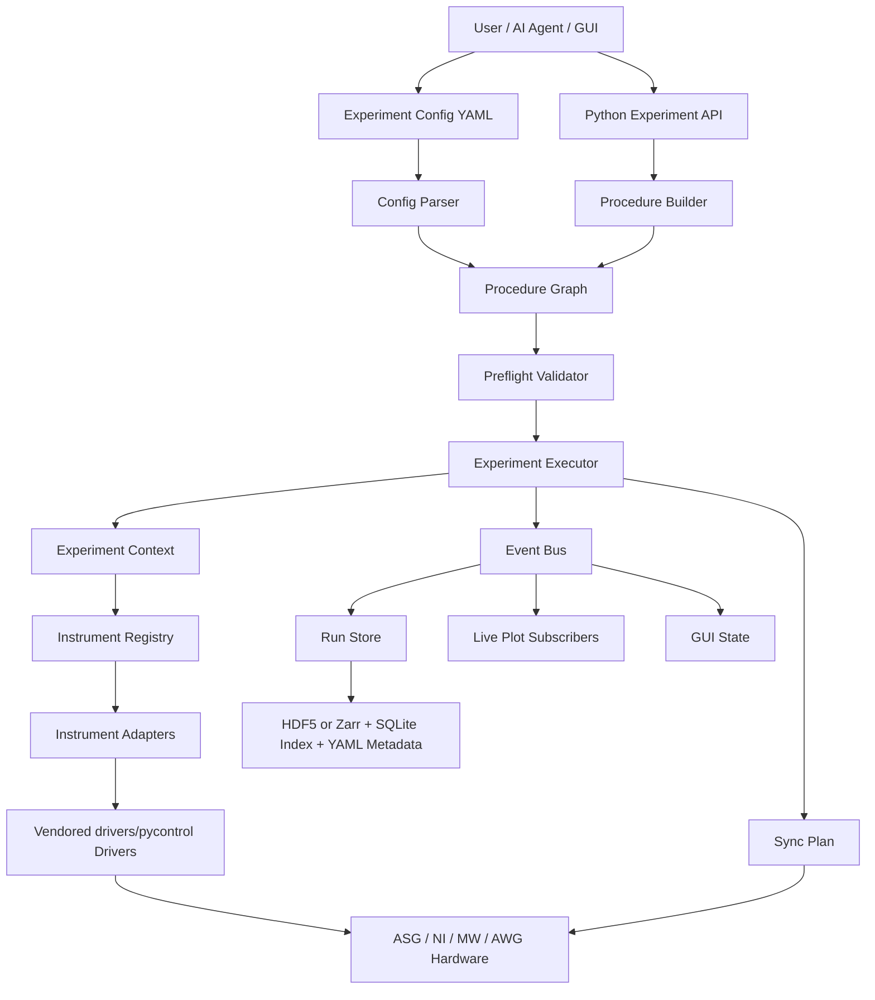
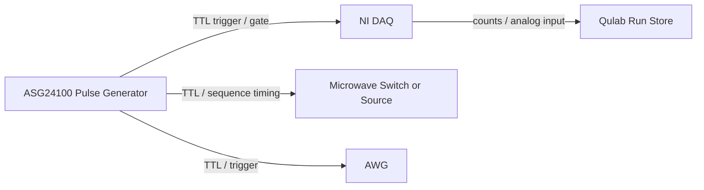

# Qulab Project Blueprint

本文档是 `qulab` 项目的总控工程说明，主要读者是后续 AI agent、human maintainer 和分工 worker。任何新对话、新 worker、新模块开发，都应先阅读本文档，再阅读 `docs/` 和 `workers/` 下的对应规范。

## 1. 项目目标

`qulab` 是面向 NV 色心、固态自旋、量子传感实验的轻量化实验编排与数据框架。

项目不以重新发明所有仪器驱动为目标，而以统一实验意图为目标：

- setup：连接仪器、设置初态、加载序列。
- procedure：用直观的 scan、loop、average、run 表达实验流程。
- measurement point：每个扫描点可以是一段完整子流程，而不只是一次简单读数。
- sync：描述 ASG、NI、AWG、微波源之间的触发和时钟关系。
- acquire：稳定地采集数据。
- store：完整保存参数、数据、仪器状态、序列、日志、版本。
- plot：实时绘图与离线分析。
- gui：让非程序用户也能搭建流程和配置仪器。

核心定位：

> 驱动层兼容并随项目携带 `drivers/pycontrol`，流程层像 Python for-loop 一样直观，配置层可被 GUI/块编辑器表达，数据层像 QCoDeS 一样可追溯，但整体比 LabVIEW 更轻、更适合 Git、更适合 AI worker 维护。

## 2. 非目标

以下内容不要在 MVP 阶段实现：

- 不做完整通用时序编译器。
- 不试图统一所有厂商仪器的所有私有功能。
- 不把 GUI 直接绑定到具体实验脚本。
- 不为了“框架感”过早引入复杂插件系统、远程调度系统、分布式任务系统。
- 不把实时硬件同步交给 Python `sleep`。

MVP 阶段需要把“已有驱动 + 实验流程 + 数据存储 + 实时显示 + 操作者运行 UI + procedure tree editor”跑通。MVP 的 GUI 不要求漂亮完整，但必须让实际实验操作者能安全、直观地选择实验、改参数、连接仪器、开始/暂停/停止、看实时数据、保存结果。

特别要求：即使在二维、三维甚至更高维扫描中，每个扫描点也必须能表达为一个完整的 measurement sub-procedure。例如一个点可以包含：设置微波频率、更新 ASG pulse sequence 参数、arm DAQ、运行特殊脉冲序列、读取多段计数、读取模拟波形、记录仪器快照、保存中间结果、做单点内平均或拟合。框架不能假设“一个扫描点只产生一个 scalar”。

## 3. 成功标准

### 3.1 MVP 成功标准

MVP 必须能完成：

1. 通过 adapter 使用项目内 `drivers/pycontrol` 中的 ASG、NI、LMX、AWG 驱动。
2. 用 Python API 定义单参数扫描和二维扫描。
3. 用 YAML 定义同等实验流程。
4. 支持 `setup -> scan -> average -> run_once -> cleanup`。
5. 每次实验自动创建 run 目录，保存 config、resolved config、metadata、events、data。
6. 实时显示 1D line plot 和 2D heatmap。
7. 有 simulation/dry-run 模式，不连接硬件也能完整执行流程。
8. 至少提供 ODMR 和 Rabi 两个示例。
9. 对异常执行安全关断：微波关、脉冲停、DAQ task close。
10. 提供 GUI procedure tree editor，可以用树形结构编辑 setup、scan、average、run、cleanup。
11. 提供 operator run UI，可以让操作者加载实验、检查仪器、修改常用参数、运行、暂停、停止、查看实时图和日志。
12. 支持每个扫描点保存复杂数据：scalar、array、trace、image-like array、shot records、instrument snapshot、sequence snapshot、analysis result。
13. 支持高维扫描的 append-only 数据写入，实验中断时已采集数据仍可读取和复现。

### 3.2 可用版成功标准

可用版应增加：

1. GUI 仪器子面板。
2. 更完整的 GUI procedure tree editor，支持拖拽重排、复制 step、禁用 step、参数校验。
3. run browser 和数据浏览。
4. pause、stop、resume。
5. preflight check：参数范围、连接状态、触发关系、采样窗口。
6. setup profile：同一实验可以切换不同硬件连接配置。

## 4. 总体架构



### 4.1 层职责

`core`：

- 定义实验流程模型。
- 定义参数、扫描、平均、条件、步骤、事件。
- 不导入 PyQt，不直接接触硬件驱动。

`instruments`：

- 定义 capability-based adapter。
- 把具体仪器驱动翻译成通用能力。
- 不承担实验流程编排。

`sync`：

- 描述硬件同步关系。
- 做 preflight 检查。
- 不做复杂时序编译，但必须明确 arm/start/read 顺序。
- 默认理解为 ASG 发出硬件 gate/trigger，NI 在 armed 状态下响应并采集；Python 负责配置、arm、start、read，不负责精密时间点对齐。

`storage`：

- 保存 run 目录、metadata、events、dataset。
- 任何实验数据必须通过 storage 写入。

`plotting`：

- 订阅事件并显示实时图。
- 不直接调用仪器，不改实验状态。

`gui`：

- 编辑 config，显示仪器状态、流程、图、数据。
- 不直接写死实验逻辑。
- MVP 必须包含 operator run UI 和 procedure tree editor。

`experiments`：

- 放通用实验模板，如 ODMR、Rabi、Ramsey。
- 模板必须同时能被 Python API 和 YAML config 表达。

### 4.2 Pulse sequence、sync plan、procedure 的关系

单点测量内的精密脉冲由 ASG/AWG 的 sequence 和仪器子面板管理；高维扫描、平均、每个点调用哪些仪器动作由 procedure 管理；ASG 触发 NI/AWG 的关系由 sync plan 管理。

典型执行关系：

```text
procedure:
  scan tau_s
    measurement point:
      set mw frequency
      set ASG sequence parameter tau_s
      arm NI
      arm ASG
      start ASG
      read NI

pulse sequence inside ASG:
  laser init -> MW pulse -> wait tau -> readout laser -> NI/APD gate

sync plan:
  master = ASG
  ASG ch5 -> NI PFI0 rising edge
  arm order = NI before ASG
```

这三者都重要，但职责不同。框架必须允许 procedure 更新单点内 pulse sequence 的参数，而不把脉冲细节硬编码进扫描循环。

## 5. 文件夹结构

当前项目应保持如下结构：

```text
qulab/
  PROJECT_BLUEPRINT.md
  README.md
  pyproject.toml
  .gitignore

  docs/
    ARCHITECTURE.md
    IMPLEMENTATION_ORDER.md
    NAMING_AND_GIT.md
    CONFIG_SCHEMA.md
    DATA_MODEL.md
    HARDWARE_SYNC.md
    ADAPTER_REQUIREMENTS.md
    OPERATOR_UI.md

  workers/
    README.md
    core_worker.md
    adapter_worker.md
    sync_worker.md
    storage_worker.md
    plotting_worker.md
    gui_worker.md
    experiment_template_worker.md
    qa_worker.md

  src/qulab/
    __init__.py
    core/
    instruments/
    sync/
    storage/
    plotting/
    gui/
    experiments/

  configs/
    setups/
    experiments/

  examples/
  tests/
    unit/
    integration/
    hardware/

  scripts/
  data/
  runs/
```

## 6. 实现顺序和优先级

### P0：工程地基

1. 创建 Python package：`src/qulab`。
2. 添加 `pyproject.toml`。
3. 建立 lint/test 入口。
4. 定义基本命名规范、git 规范、worker 规范。

完成标准：

- `python -m pytest` 可以运行。
- `import qulab` 成功。

### P1：核心流程模型

实现：

- `Parameter`
- `ParameterRef`
- `Step`
- `ActionStep`
- `ScanStep`
- `AverageStep`
- `RunStep`
- `MeasurementStep`
- `Procedure`
- `ExperimentContext`
- `Event`
- `EventBus`

完成标准：

- 能构造二维 scan + average 的 procedure graph。
- 能表达“每个扫描点内部是一段完整 measurement procedure”。
- 能 dry-run 执行并产出事件流。

### P2：仪器 capability 和 adapter

实现：

- `InstrumentAdapter`
- `Capability`
- `MicrowaveSource`
- `PulseSequencer`
- `DAQCounter`
- `AnalogInput`
- `AnalogOutput`
- `WaveformGenerator`
- `InstrumentRegistry`
- `SetupProfile`

完成标准：

- mock adapter 可以被 executor 调用。
- pycontrol adapter 可以初始化，但硬件调用必须可 dry-run。

### P3：executor 和 storage 闭环

实现：

- `ExperimentExecutor`
- `RunStore`
- `MetadataWriter`
- `DatasetWriter`
- `EventLogger`

完成标准：

- 执行一个 dry-run ODMR。
- 生成 run 目录。
- 保存 config、metadata、events、data。

### P4：真实 pycontrol 适配

实现：

- `pycontrol_asg.py`
- `pycontrol_ni.py`
- `pycontrol_lmx.py`
- `pycontrol_awg.py`

完成标准：

- 支持连接、配置、arm/start/read/stop。
- 支持 simulation flag。
- 不在 import 阶段强制加载 Windows-only 或硬件-only 依赖。

### P5：同步计划和 preflight

实现：

- `SyncPlan`
- `TriggerEdge`
- `ClockRelation`
- `ExecutionPhase`
- `SyncValidator`

完成标准：

- 能明确 ASG master trigger -> NI PFI input 的运行顺序。
- 发现采样窗口、平均次数、触发线缺失等错误。

### P6：实时绘图

实现：

- `LivePlotSubscriber`
- `LinePlot`
- `HeatmapPlot`

完成标准：

- dry-run 二维数据能实时更新 heatmap。

### P7：GUI

MVP GUI 必须先实现操作者运行界面和基础 procedure tree editor。

实现：

- main window。
- setup profile editor。
- instrument panels。
- procedure tree editor。
- run browser。

完成标准：

- GUI 生成的 config 可以被 CLI executor 运行。
- 操作者可以从 GUI 完成一次 dry-run ODMR 或 Rabi。

## 7. 时序在框架中的位置

本项目把“时序”拆成三层，不混在一个模块里：

### 7.1 Pulse Sequence Layer

位置：

- 外部已有 `sequence_editor`。
- 未来可放在 `src/qulab/gui/instrument_panels/asg_panel.py` 或 `src/qulab/sequences/`。

职责：

- 编辑 ASG 脉冲波形、通道、laser/mw/readout gate。
- 导出 ASG 可加载的 sequence 或代码。
- 暴露可扫描参数，如 `tau_s`、`laser_width_s`、`readout_delay_s`。

不负责：

- 二维扫描。
- 平均。
- 数据存储。
- 多仪器执行顺序。

### 7.2 Sync Plan Layer

位置：

- `src/qulab/sync/`
- 文档：`docs/HARDWARE_SYNC.md`

职责：

- 描述 ASG、NI、AWG、MW 之间的触发关系。
- 声明哪个设备是 master。
- 声明 trigger source/target、edge、clock、arm/start/read 顺序。
- 做 preflight check。

不负责：

- 生成 ASG 脉冲细节。
- 保存实验数据。

### 7.3 Procedure Layer

位置：

- `src/qulab/core/procedure.py`
- GUI 的 procedure tree editor。

职责：

- 描述实验流程：setup、scan、average、run、cleanup。
- 决定“先设置微波频率，再设置 tau，再 arm DAQ，再 start ASG，再 read counts”。
- 决定一维/二维/多维扫描和平均。

这就是本项目最重要的通用性所在。procedure 不是纳秒级时序，而是实验动作的顺序编排。

## 8. 最终效果直观图景

操作者打开 GUI 后，第一屏不是代码编辑器，而是实验控制台：

```text
┌────────────────────────────────────────────────────────────────────┐
│ Qulab Run Console                                  Setup: NV_Main   │
├───────────────┬───────────────────────────────┬────────────────────┤
│ Experiments   │ Procedure Tree                │ Instruments        │
│ - ODMR        │ setup                         │ MW   connected    │
│ - Rabi        │  ├─ mw.set_power              │ ASG  connected    │
│ - Ramsey      │  ├─ asg.load_sequence         │ DAQ  connected    │
│               │ scan mw_freq                  │ AWG  offline      │
│ Parameters    │  ├─ mw.set_frequency          │                    │
│ mw_start      │  └─ average 100               │ Run Controls       │
│ mw_stop       │      └─ run pulse_readout     │ Prepare Start Stop │
│ points        │          ├─ daq.arm           │ Pause Resume       │
│ averages      │          ├─ asg.arm           │                    │
│               │          ├─ asg.start         │ Preflight          │
│               │          └─ daq.read_counts   │ all checks passed  │
├───────────────┴───────────────────────────────┴────────────────────┤
│ Live Plot: ODMR counts vs microwave frequency                       │
├────────────────────────────────────────────────────────────────────┤
│ Run Log: connected, loaded sequence, running point 32/101...        │
└────────────────────────────────────────────────────────────────────┘
```

典型使用流程：

1. 选择实验模板：ODMR、Rabi、Ramsey。
2. 选择 setup profile：当前实验台的 ASG/NI/MW 连接配置。
3. 在参数面板里改起止频率、点数、平均次数。
4. 在 procedure tree 中检查实验流程。
5. 在 ASG 子面板中打开 sequence editor，确认 pulse sequence 和可扫描参数。
6. 点击 Prepare，系统连接仪器并运行 preflight。
7. 点击 Start，实时图开始刷新，数据自动保存。
8. 中途可以 Pause/Stop，异常时自动 safety shutdown。
9. 实验结束后 run browser 中能打开数据、config、metadata、图和日志。

最终用户不需要知道底层 executor、adapter、storage 怎么实现，但后续 AI worker 必须保证 GUI 操作等价于一份可保存、可复现、可 CLI 运行的 YAML config。

## 9. 复杂实验能力边界

本框架必须支持复杂和繁琐的实验，但实现方式要保持轻量：

- 复杂性放在 procedure tree 和 config 中表达，不写死在 GUI 回调里。
- 硬件细节放在 adapter 和 instrument subpanel 中，不污染实验模板。
- 数据复杂性由 structured event 和 RunStore 处理，不要求每个实验手写保存逻辑。
- 高维扫描采用 append-only point records，不要求预先知道完整数据 shape。
- 常用结果可以实时聚合成 line/heatmap，但原始 point data 必须能完整保存。

一个复杂扫描点的概念模型：

```text
scan magnetic_field
  scan mw_freq
    scan tau_s
      measurement point
        set mw frequency
        set ASG sequence param tau_s
        capture pre-shot instrument snapshot
        average N
          arm daq
          arm asg
          start asg special pulse sequence
          read raw photon bins
          read analog trace
        compute point summary
        emit:
          scalar counts_mean
          array photon_bins
          array analog_trace
          metadata sequence_hash
          metadata instrument_snapshot
```

这意味着 plotting 可以只显示 `counts_mean`，但 storage 仍保存 `photon_bins`、`analog_trace` 和每个点的 metadata。

## 7. Adapter 设计核心原则

不要统一仪器型号，统一仪器能力。

错误示例：

```python
instrument.set("frequency", 2.87e9)
instrument.run()
```

正确方向：

```python
class MicrowaveSource:
    def set_frequency(self, freq_hz: float) -> None: ...
    def set_power(self, power_dbm: float) -> None: ...
    def output_on(self) -> None: ...
    def output_off(self) -> None: ...
```

一个真实 adapter 可以实现多个 capability。

例如 NI：

- `DAQCounter`
- `AnalogInput`
- `AnalogOutput`
- `TriggerReceiver`
- `ClockParticipant`

例如国仪 ASG：

- `PulseSequencer`
- `DigitalOutput`
- `TriggerSource`
- `ClockParticipant`

## 8. Procedure DSL 要求

Python API 示例：

```python
exp = Experiment("rabi_2d")
mw = exp.resource("mw")
asg = exp.resource("asg")
daq = exp.resource("daq")

exp.setup(
    mw.set_power(-10),
    mw.output_on(),
    asg.load_sequence("rabi.seq"),
    daq.configure_counter(sample_rate=100_000, samples=1000),
)

with exp.scan("mw_freq", start=2.86e9, stop=2.88e9, points=101):
    mw.set_frequency(P("mw_freq"))
    with exp.scan("tau", start=20e-9, stop=2e-6, points=100):
        asg.set_sequence_param("tau", P("tau"))
        with exp.average(100):
            exp.run_once(
                daq.arm(),
                asg.arm(),
                asg.start(),
                daq.read_counts(save_as="counts"),
            )
```

YAML config 示例：

```yaml
schema_version: 1
name: rabi_2d

resources:
  mw:
    adapter: pycontrol_lmx
    capabilities: [microwave_source]
    port: COM5

  asg:
    adapter: pycontrol_asg
    capabilities: [pulse_sequencer]

  daq:
    adapter: pycontrol_ni
    capabilities: [daq_counter]
    device: Dev2

setup:
  - call: mw.set_power
    args: { power_dbm: -10 }
  - call: mw.output_on
  - call: asg.load_sequence
    args: { path: rabi.seq }

procedure:
  - scan:
      name: mw_freq
      values: { start: 2.86e9, stop: 2.88e9, points: 101 }
      body:
        - call: mw.set_frequency
          args: { freq_hz: ${mw_freq} }
        - scan:
            name: tau
            values: { start: 20e-9, stop: 2e-6, points: 100 }
            body:
              - call: asg.set_sequence_param
                args: { name: tau, value: ${tau} }
              - average:
                  count: 100
                  body:
                    - run:
                        steps:
                          - call: daq.arm
                          - call: asg.arm
                          - call: asg.start
                          - call: daq.read_counts
                            save_as: counts
```

## 9. 数据存储要求

每次实验必须创建唯一 run 目录：

```text
runs/YYYY-MM-DD/YYYYMMDD_HHMMSS_experiment_name/
  config.yaml
  resolved_config.yaml
  metadata.json
  events.jsonl
  data.h5
  preview.png
  logs.txt
```

必须记录：

- experiment name。
- user。
- start/end time。
- machine。
- git commit，如果项目是 git 仓库。
- qulab version。
- pycontrol version 或路径。
- full setup profile。
- full resolved procedure。
- sequence 文件快照或 hash。
- instrument state snapshot。
- every data point event。
- exception traceback。

## 10. 硬件同步要求

核心硬件架构默认以国仪 ASG 和 NI DAQ 为中心：



同步模型必须表达：

- master device。
- trigger source channel。
- trigger target channel。
- trigger edge。
- clock source。
- arm order。
- start order。
- read order。
- timeout。
- safety shutdown。

典型顺序：

1. configure all devices。
2. arm DAQ。
3. arm ASG。
4. start ASG。
5. wait/read DAQ。
6. emit data event。
7. stop or continue。

Python 不应承担纳秒/微秒级同步，只负责配置和触发运行。硬件同步必须由 ASG、NI counter、外部触发线、内部路由完成。

## 11. AI Worker 工作原则

任何 worker 开始前必须：

1. 阅读 `PROJECT_BLUEPRINT.md`。
2. 阅读 `docs/ARCHITECTURE.md`。
3. 阅读自己的 `workers/<role>_worker.md`。
4. 查看当前 git status，如果项目已经初始化 git。
5. 不修改无关模块。
6. 不把硬件-only import 放在模块顶层，除非该模块只能在硬件环境导入。
7. 不静默吞掉硬件错误。
8. 写测试或 dry-run 示例证明行为。

任何 worker 完成后必须：

1. 更新相关文档。
2. 更新或新增测试。
3. 在 final summary 中说明改动文件、验证命令、未完成风险。
