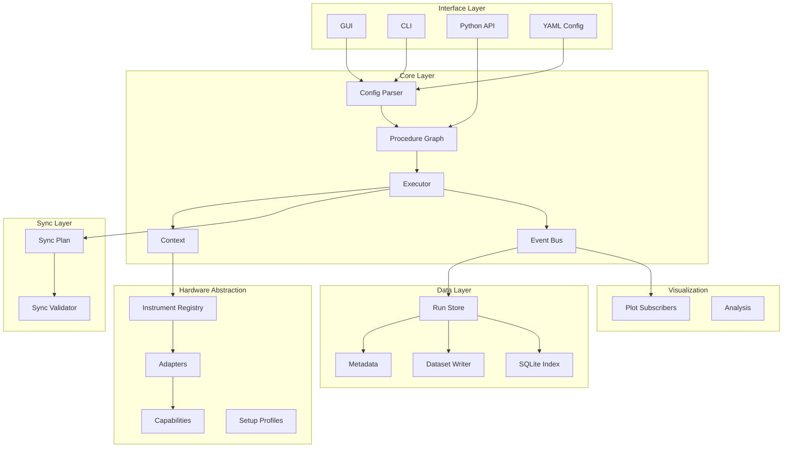

# Architecture

本文档定义 `qulab` 的架构边界。实现时不要跨层偷懒，否则后续 GUI、硬件联调和数据追踪都会变得难以维护。

## 1. 架构原则

1. 实验逻辑不直接依赖具体仪器型号。
2. GUI 不直接调用硬件驱动，而是编辑 config 或调用 executor。
3. 硬件 adapter 不负责扫描循环。
4. 数据写入不散落在实验代码里，统一经过 `RunStore`。
5. 实时绘图通过事件订阅，不阻塞采集。
6. 真实硬件同步由硬件触发和时钟完成，Python 只编排。
7. 所有实验都应该可 dry-run。
8. MVP GUI 必须包含 operator run UI 和 procedure tree editor，保证实际操作者能不用写代码完成常规实验运行。
9. 框架不能假设一个扫描点只产生一个数值；每个扫描点可以是完整 measurement sub-procedure，并产生 scalar、array、trace、snapshot、artifact。

## 2. 层级图



## 3. Core Layer

### 3.1 `Parameter`

职责：

- 表示实验参数。
- 支持单位、范围、默认值、当前值。
- 支持引用：`P("mw_freq")`。

不得：

- 直接访问仪器。
- 直接写数据文件。

### 3.2 `Step`

基础 step 类型：

- `ActionStep`：调用某个 resource 的方法。
- `ScanStep`：对参数列表迭代。
- `AverageStep`：重复执行 body 并聚合。
- `RunStep`：一个硬件运行单元，通常包含 arm/start/read。
- `MeasurementStep`：一个扫描点内部的完整测量子流程，负责生成 point_id 并关联该点的所有数据。
- `CleanupStep`：实验结束或错误时执行。

每个 step 必须有：

- stable id。
- human-readable name。
- input parameters。
- output keys。
- dry-run behavior。
- timeout，可选。
- error policy。

### 3.3 `Procedure`

职责：

- 保存 step tree。
- 提供 validation。
- 提供 flatten/iterator 供 executor 使用。

不得：

- 在构造时连接硬件。
- 在构造时写数据。

### 3.4 `Executor`

职责：

- 执行 setup。
- 执行 procedure。
- 管理 context。
- 发送事件。
- 接受 stop/pause/resume。
- 保证 cleanup。

执行器必须有明确状态机：

```text
created -> prepared -> running -> pausing -> paused -> stopping -> completed
                                 -> failed
```

## 4. Instrument Layer

### 4.1 `InstrumentAdapter`

adapter 是具体硬件/驱动与 qulab capability 的桥。

每个 adapter 必须实现：

- `connect()`
- `disconnect()`
- `snapshot()`
- `health_check()`
- `capabilities()`
- `simulation` 标志

### 4.2 Capability

capability 是实验流程可依赖的接口。MVP 需要：

- `MicrowaveSource`
- `PulseSequencer`
- `DAQCounter`
- `AnalogInput`
- `AnalogOutput`
- `WaveformGenerator`
- `TriggerSource`
- `TriggerReceiver`
- `ClockParticipant`

## 5. Sync Layer

同步层不编译纳秒级序列，但必须声明硬件运行关系。

核心对象：

- `SyncPlan`
- `TriggerEdge`
- `ClockRelation`
- `PhaseOrder`
- `SyncValidationResult`

MVP 默认模型：

```text
configure -> arm_daq -> arm_pulse -> start_pulse -> read_daq -> stop_optional
```

## 5.1 Timing Model Boundary

`qulab` 中“时序”有三个不同含义，必须分清：

1. Pulse sequence：ASG/AWG 内部的纳秒或微秒级波形，通常由已有 sequence editor 或仪器子面板管理。
2. Sync plan：多个仪器之间的硬件触发和 arm/start/read 顺序，由 `sync` 层管理。
3. Procedure order：实验动作的宏观流程，如 scan、average、set_frequency、read_counts，由 `core` 层管理。

MVP 不实现通用 pulse compiler。MVP 必须实现 procedure order 和 sync plan，并能桥接已有 sequence editor。

### 5.2 ASG Sequence Editor Boundary

国仪 ASG 的 pulse sequence 不应被展开成主 workflow tree 里的大量纳秒级步骤。主 workflow tree 只表达宏观实验流程和单点测量流程，例如：

```text
scan tau_s
  measurement rabi_point
    mw.set_frequency(${mw_freq_hz})
    asg.load_sequence(rabi.seq)
    asg.set_sequence_param("tau_s", ${tau_s})
    daq.arm()
    asg.arm()
    asg.start()
    daq.read_counts()
```

真实 pulse sequence 的编辑、通道映射、脉冲宽度、delay、loop、trigger 输出等细节属于 ASG 仪器子面板和 sequence editor bridge。Qulab GUI 应复用已有 standalone sequence editor，而不是重新实现一套脉冲编辑器。

ASG sequence bridge 的职责：

- 选择 sequence 文件。
- 打开已有 standalone sequence editor。
- 预览 sequence 文件、通道映射和可扫描参数。
- 将 procedure/config 中的参数引用绑定到 sequence 参数，例如 `tau_s <- ${tau_s}`。
- 在运行前生成 sequence snapshot/hash，写入 metadata 或 point snapshot。
- 向 sync/preflight 暴露估算 sequence duration、trigger channel 和 ASG channel usage。

ASG sequence bridge 不负责：

- 执行扫描循环。
- 直接写实验数据。
- 绕过 executor 启动硬件输出。
- 把 pulse sequence 编译成通用硬件无关 timing graph。

## 6. Storage Layer

数据层接收事件，不主动控制实验。

事件类型：

- `RunStarted`
- `RunCompleted`
- `StepStarted`
- `StepCompleted`
- `ParameterChanged`
- `DataPoint`
- `ArrayData`
- `LogMessage`
- `ErrorRaised`
- `InstrumentSnapshot`
- `MeasurementStarted`
- `MeasurementCompleted`

数据层必须同时支持：

- summary data：用于实时画图和快速浏览。
- raw point data：每个扫描点内部的原始 trace、bins、shot records。
- metadata：每个点的仪器状态、sequence hash、错误状态。

实时图不等于完整数据。绘图可以只订阅 summary scalar，storage 必须保存完整 point record。
## 7. GUI Layer

GUI 是 config/procedure 的编辑器和事件显示器。GUI 不应该含有只能在 GUI 中运行的实验逻辑。

GUI 产生的 YAML 必须能被 CLI 执行。

MVP GUI 分为两个核心能力：

- Operator Run Console：给实际操作者运行实验，包含实验选择、参数编辑、仪器状态、preflight、start/pause/stop、实时图、日志。
- Procedure Tree Editor：给高级用户和 AI worker 修改实验流程，树形编辑 setup、scan、average、run、cleanup。

这两个能力不要求拆成两个独立窗口。推荐在同一个主界面中提供一键切换的工作区 submode：

- Builder submode：显示 workflow tree + inspector，用于编辑 procedure 结构。
- Operator Parameters submode：显示常用实验参数表单，用于现场快速调参。
- Direct Control submode：显示受安全门控的手动控制面板，用于 connect/read-only/configure-only 或被明确授权的低风险动作。

Direct Control submode 必须遵守 bench commissioning 和 safety policy。默认不得打开微波输出、启动 ASG/AWG、写 NI AO 或执行未知危险动作；这些动作必须有明确授权、清楚标识，并通过同一 adapter/executor/bench 层路径记录事件。

仪器子面板可以在 MVP 做简化，但 ASG sequence editor bridge 必须预留接口。
